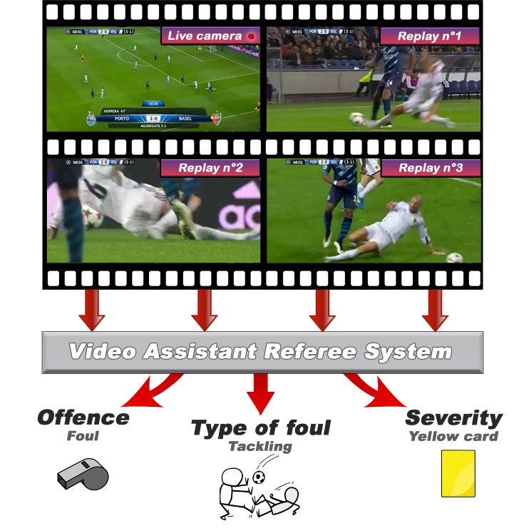
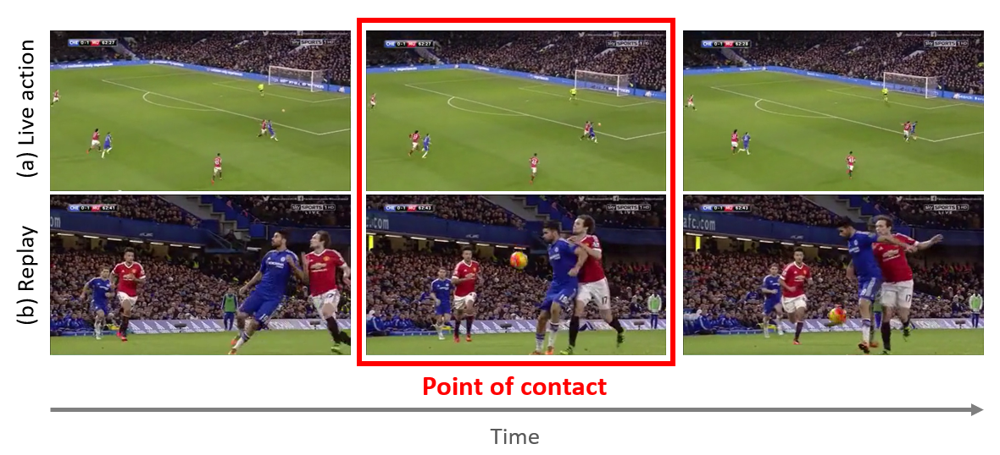
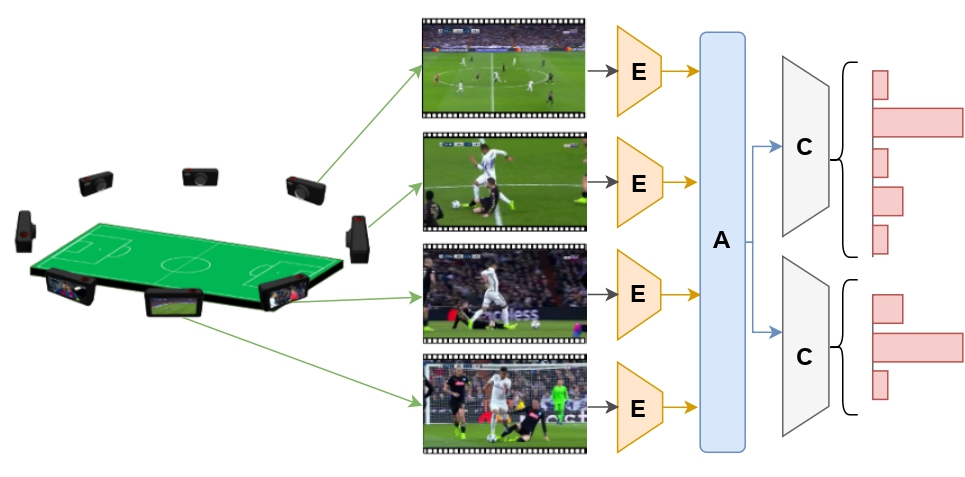
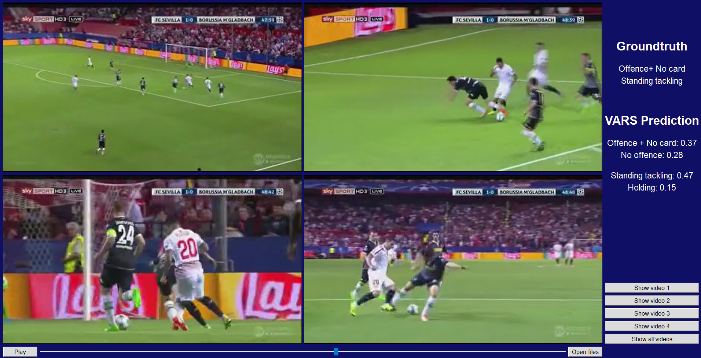

# MultiView Football Referee Assistance Technology (MFRAT)



## Project Overview

The MultiView Football Referee Assistance Technology (MFRAT) aims to revolutionize football refereeing through automated video analysis. While professional leagues utilize Video Assistant Referee (VAR) systems, their high cost and infrastructure requirements limit accessibility. Our project represents a significant step toward democratizing this technology.

**Project Team:**
- **Developers:** AMLLAL Amine, AKEBLI FatimaEzzahrae, ELHAKIOUI Asmae
- **Supervisor:** MASROUR Tawfik

## Football Incident Analysis Dataset (FIAD)



Our custom dataset contains 3,901 football incidents captured simultaneously from multiple camera angles. Each incident includes:
- At least two live-action perspectives
- Minimum one replay view
- Annotations for 10 distinct properties (infraction type, severity, etc.)

The dataset is structured as:
- Training set: 2,916 incidents
- Validation set: 411 incidents
- Test set: 301 incidents
- Challenge set: 273 incidents (unannotated)

### Data Access

To access the dataset:
1. Complete the required confidentiality agreement
2. Use our API for downloading:
```python
from SoccerNet.Downloader import SoccerNetDownloader as SNdl
mySNdl = SNdl(LocalDirectory="path/to/dataset")
mySNdl.downloadDataTask(task="footballincidents", split=["train","valid","test","challenge"], password="your_password")
```

For higher resolution (720p), add `version="720p"` to the arguments.

## Technical Architecture



Our system employs a multi-view video processing pipeline with three key components:
1. **Encoder (E)**: Extracts features from each camera angle independently
2. **Aggregator (A)**: Combines information across all available views
3. **Classifier (C)**: Determines incident properties through specialized modules

## Implementation

### Environment Setup
```bash
conda create -n mfrat python=3.9
conda activate mfrat
# Install PyTorch with CUDA: https://pytorch.org/get-started/locally/
pip install -r requirements.txt
pip install pyav
```

### Model Training
```bash
python main.py --path "path/to/dataset"
```

### Model Inference
```bash
python main.py --pooling_type "attention" --start_frame 63 --end_frame 87 --fps 17 --path "path/to/dataset" --pre_model "mvit_v2_s" --path_to_model_weights "14_model.pth.tar"
```

> Note: Incidents typically occur around frame 75. Adjust frame parameters accordingly.

## Interactive Interface



Our interface provides:
- Access to all camera perspectives for each incident
- Top two predictions for incident classification 
- Confidence scores for each prediction
- Ground truth annotations for comparison

### Interface Setup
```bash
conda create -n mfrat_ui python=3.9
conda activate mfrat_ui
pip install -r requirements.txt
pip install av
```

Download model weights from our repository and save to the "interface" folder.

Launch the interface:
```bash
python main.py
```

## Demo Examples

Example 1:


Example 2:


## License
See the [License](LICENSE) file for details.
