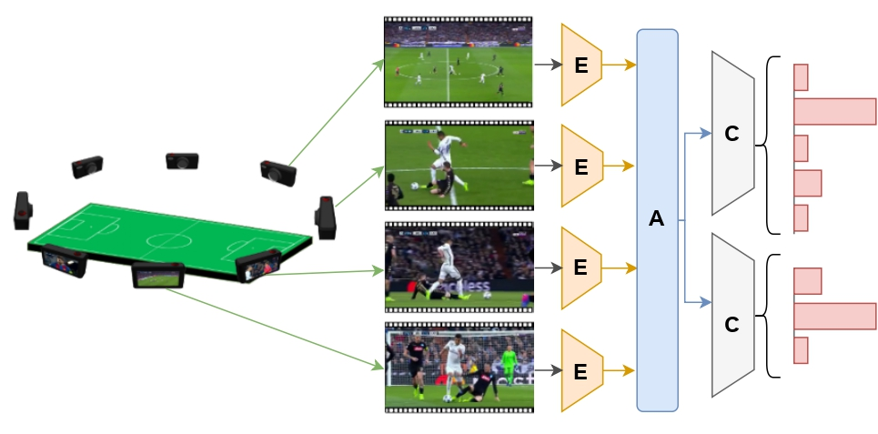

System Architecture
==================

This document provides a detailed overview of the VARS system architecture, including the multi-view video processing pipeline and neural network design.

Overview
--------

The VARS system employs a three-stage pipeline designed to process multi-view video data and classify football fouls:

The architecture consists of three main components:

1. **Encoder (E)**: Feature extraction from individual camera views
2. **Aggregator (A)**: Multi-view information fusion
3. **Classifier (C)**: Multi-task foul classification

Stage 1: Video Encoder
---------------------

The encoder processes video clips from each camera view independently to extract spatio-temporal features.

Supported Backbone Networks
~~~~~~~~~~~~~~~~~~~~~~~~~~

The system supports multiple state-of-the-art video architectures:

**3D CNNs:**

* **R3D-18**: 3D ResNet with 18 layers
* **MC3-18**: Mixed 3D convolutions 
* **R(2+1)D-18**: Decomposed 3D convolutions
* **S3D**: Spatially separable 3D convolutions

**Vision Transformers:**

* **MViT-v1-B**: Multi-scale Vision Transformer (Base)
* **MViT-v2-S**: Multi-scale Vision Transformer v2 (Small) - *Recommended*

Architecture Selection
~~~~~~~~~~~~~~~~~~~~

.. code-block:: python

   from model import MVNetwork
   
   # Create model with different backbones
   model_mvit = MVNetwork(net_name="mvit_v2_s")    # Best performance
   model_r3d = MVNetwork(net_name="r3d_18")        # Fast inference
   model_r2plus1d = MVNetwork(net_name="r2plus1d_18")  # Good balance

**Feature Dimensions:**

==================  ================  ===============
Backbone            Feature Dim       Params (M)
==================  ================  ===============
R3D-18              512               33.2
MC3-18              512               11.7  
R(2+1)D-18          512               31.5
S3D                 400               9.6
MViT-v1-B           768               36.6
MViT-v2-S           400               34.4
==================  ================  ===============

Input Processing
~~~~~~~~~~~~~~~

Video clips are preprocessed before entering the encoder:

.. code-block:: python

   # Input tensor shape: [batch, views, channels, frames, height, width]
   # Example: [8, 2, 3, 25, 224, 224]
   
   # Preprocessing pipeline:
   transform = transforms.Compose([
       transforms.Resize((224, 224)),
       transforms.Normalize(
           mean=[0.485, 0.456, 0.406],
           std=[0.229, 0.224, 0.225]
       )
   ])

Stage 2: Multi-View Aggregation
------------------------------

The aggregation module combines features from different camera views using various fusion strategies.

Aggregation Methods
~~~~~~~~~~~~~~~~~

**1. Max Pooling Aggregation**

Takes the maximum activation across all views:

.. code-block:: python

   class ViewMaxAggregate(nn.Module):
       def forward(self, mvimages):
           # mvimages: [B, V, C, D, H, W]
           features = self.model(batch_tensor(mvimages))
           pooled = torch.max(features, dim=1)[0]
           return pooled

**2. Average Pooling Aggregation**

Computes the mean activation across views:

.. code-block:: python

   class ViewAvgAggregate(nn.Module):
       def forward(self, mvimages):
           features = self.model(batch_tensor(mvimages))
           pooled = torch.mean(features, dim=1)
           return pooled

**3. Attention-Based Aggregation** *(Recommended)*

Uses learnable attention weights to focus on the most informative views:

.. code-block:: python

   class WeightedAggregate(nn.Module):
       def __init__(self, feat_dim):
           self.attention_weights = nn.Parameter(
               torch.randn(feat_dim, feat_dim)
           )
           
       def forward(self, mvimages):
           features = self.model(batch_tensor(mvimages))
           
           # Compute attention scores
           attention_input = torch.matmul(features, self.attention_weights)
           attention_scores = self.compute_attention(attention_input)
           
           # Weighted aggregation
           output = torch.sum(features * attention_scores.unsqueeze(-1), dim=1)
           return output, attention_scores

Attention Mechanism Details
~~~~~~~~~~~~~~~~~~~~~~~~~~

The attention mechanism computes view-specific importance weights:

1. **Feature Transformation**: ``f' = f · W_attention``
2. **Similarity Computation**: ``S = f' · (f')^T``
3. **Attention Weights**: ``α = softmax(ReLU(S))``
4. **Weighted Features**: ``output = Σ(α_i · f_i)``

This allows the model to dynamically focus on the most informative camera angles for each specific incident.

Stage 3: Multi-Task Classification
---------------------------------

The final stage performs simultaneous classification of foul properties using specialized heads.

Classification Architecture
~~~~~~~~~~~~~~~~~~~~~~~~~~

.. code-block:: python

   class MVAggregate(nn.Module):
       def __init__(self, feat_dim=400):
           # Shared intermediate layer
           self.inter = nn.Sequential(
               nn.LayerNorm(feat_dim),
               nn.Linear(feat_dim, feat_dim),
               nn.Linear(feat_dim, feat_dim)
           )
           
           # Action classification head (8 classes)
           self.fc_action = nn.Sequential(
               nn.LayerNorm(feat_dim),
               nn.Linear(feat_dim, feat_dim),
               nn.Linear(feat_dim, 8)
           )
           
           # Offence/Severity classification head (4 classes)
           self.fc_offence = nn.Sequential(
               nn.LayerNorm(feat_dim),
               nn.Linear(feat_dim, feat_dim), 
               nn.Linear(feat_dim, 4)
           )

Multi-Task Learning
~~~~~~~~~~~~~~~~~

The model is trained to simultaneously predict:

**Task 1: Action Type Classification**
- 8 classes: Tackling, Standing tackling, High leg, Holding, Pushing, Elbowing, Challenge, Dive
- Loss: Cross-entropy with class balancing

**Task 2: Offence & Severity Classification**  
- 4 classes: No Offence, Offence + No card, Offence + Yellow card, Offence + Red card
- Loss: Cross-entropy with class balancing

**Combined Loss Function:**

.. math::

   L_{total} = λ_1 · L_{action} + λ_2 · L_{offence}

Where λ₁ and λ₂ are task weighting parameters (typically λ₁ = λ₂ = 1.0).

Implementation Details
--------------------

Network Initialization
~~~~~~~~~~~~~~~~~~~~~

.. code-block:: python

   def create_model(config):
       model = MVNetwork(
           net_name=config.backbone,      # "mvit_v2_s"
           agr_type=config.aggregation,   # "attention"
           feat_dim=config.feature_dim    # 400
       )
       
       # Initialize weights
       for module in model.modules():
           if isinstance(module, nn.Linear):
               nn.init.xavier_uniform_(module.weight)
               nn.init.zeros_(module.bias)
               
       return model

Memory Optimization
~~~~~~~~~~~~~~~~~

**Gradient Checkpointing**: Reduces memory usage during training

.. code-block:: python

   # Enable gradient checkpointing
   model.backbone.gradient_checkpointing = True

**Mixed Precision Training**: Faster training with lower memory

.. code-block:: python

   from torch.cuda.amp import autocast, GradScaler
   
   scaler = GradScaler()
   
   with autocast():
       predictions = model(videos)
       loss = criterion(predictions, targets)
   
   scaler.scale(loss).backward()
   scaler.step(optimizer)

Computational Complexity
-----------------------

**Theoretical Analysis:**

For input shape ``[B, V, C, T, H, W]``:

- **Encoder Complexity**: ``O(B × V × T × H × W × C)``
- **Aggregation Complexity**: ``O(B × V × V × D)`` (attention) or ``O(B × V × D)`` (pooling)
- **Classification Complexity**: ``O(B × D²)``

**Practical Performance:**

==================  ============  =============  ================
Configuration       GPU Memory    Training Time  Inference Time
==================  ============  =============  ================
Batch=8, Views=2    ~8GB          ~3 hours       ~50ms/sample
Batch=4, Views=5    ~12GB         ~5 hours       ~80ms/sample
Batch=16, Views=2   ~14GB         ~2 hours       ~30ms/sample
==================  ============  =============  ================

*Measured on RTX 3080 with MViT-v2-S backbone*

Model Variants
-------------

**VARS-Lite** (Fast inference):

.. code-block:: python

   model_lite = MVNetwork(
       net_name="r3d_18",
       agr_type="max",
       feat_dim=512
   )

**VARS-Pro** (Best accuracy):

.. code-block:: python

   model_pro = MVNetwork(
       net_name="mvit_v2_s", 
       agr_type="attention",
       feat_dim=400
   )

**VARS-Balanced** (Good trade-off):

.. code-block:: python

   model_balanced = MVNetwork(
       net_name="r2plus1d_18",
       agr_type="mean", 
       feat_dim=512
   )

Training Strategies
-----------------

**Progressive Training:**

1. **Stage 1**: Train encoder on single-view data
2. **Stage 2**: Fine-tune with multi-view aggregation
3. **Stage 3**: End-to-end training with all components

**Data Augmentation:**

- Temporal augmentation: Random frame sampling
- Spatial augmentation: Random crops, flips, color jittering
- View augmentation: Random view selection during training

**Regularization:**

- Dropout in classification heads (p=0.3)
- LayerNorm for stable training
- Weight decay (1e-4)
- Early stopping based on validation performance

Deployment Considerations
-----------------------

**Real-time Inference:**

For real-time applications, consider:

- Model quantization (INT8)
- TensorRT optimization
- Batch size optimization
- GPU memory management

**Edge Deployment:**

For mobile/edge devices:

- Use lightweight backbones (S3D, R3D-18)
- Reduce input resolution
- Optimize aggregation method
- Consider model distillation

**Scalability:**

For processing multiple matches simultaneously:

- Implement batch processing
- Use distributed inference
- Optimize I/O operations
- Consider cloud deployment

The VARS architecture provides a flexible and scalable framework for multi-view foul recognition, with options to balance between accuracy and computational efficiency based on deployment requirements.
